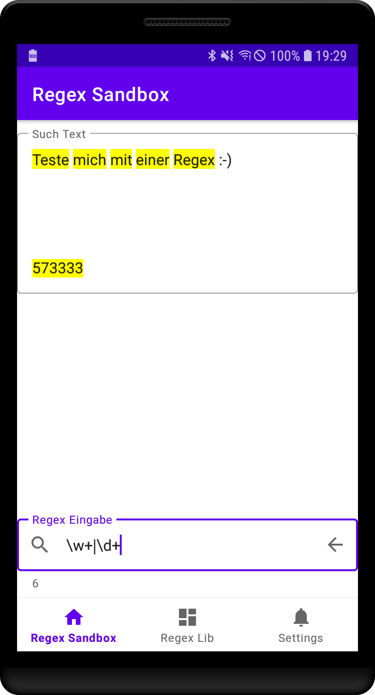

Regex Sandbox
-------------
A quick test of my skills after not writing any software for android devices for quite some time.

The app was developed consequently by using Android Matrial design. Architecture is based on MVC (Model- Controler- View) which is a great way to divide the source code into it's relevant components and keep it better organized.

Android Material design elements, especially the application of EditText views lead to much more lightweigt layouts and source code for controling these views.

Additionally, this App shows how to manipulate EditText's behavior, such as inserting text at the cursor's location.

Feel free to browse through the code and get what you need :-)

